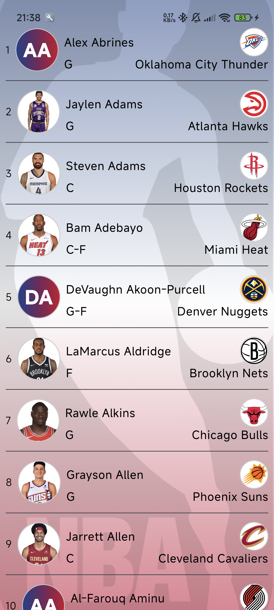

# 🏀 NBA Players List

A modern Android application built with **Kotlin** and **Jetpack Compose** to display a list of NBA players, their details, and photos.  
The app integrates multiple APIs to provide player information and images.

---

## ✨ Features

- 📋 List of NBA players with detailed information
- 🔍 Search functionality (TODO)
- 🏷️ Team logos fetched dynamically
- 🖼️ Player photos loaded from TheSportsDB
- ⚡️ Fast and smooth UI with Jetpack Compose
- 📡 Data fetched via Retrofit

---

## 🛠️ Tech Stack

- **Kotlin**
- **Jetpack Compose**
- **Retrofit** for networking
- **Glide** for image loading
- **Hilt** for dependency injection

---

## 🚀 Getting Started

### Prerequisites

- Android Studio
- Minimum SDK: 24
- balldontlie API Key

> **Note:**  
> You **must** provide your own API key for the balldontlie API.

---

### 🔑 Adding Your API Key

1. Open your project’s `local.properties` file.
2. Add the following line, replacing `YOUR_API_KEY` with your actual key:
API_KEY=YOUR_API_KEY
3. Sync the project to make sure the key is properly included.

---

### 🏷️ Team Logos

Team logos are loaded dynamically using Glide from ESPN’s CDN:
https://a.espncdn.com/i/teamlogos/nba/500/[team.abbreviation].png

---

## 🧩 Additional API Integration

Besides the balldontlie API, the app also uses the [TheSportsDB API](https://www.thesportsdb.com/api.php) to retrieve player images by name:
https://www.thesportsdb.com/api/v1/json/123/searchplayers.php?p={playerName}

This allows searching for a player by name and displaying their photo in the app.

> **Note:**  
> - TheSportsDB offers **30 free API calls per minute**.  
> - The database **does not contain all NBA players**, so some player images may be missing.

---

## 🎨 Colors

The app uses colors inspired by the official **NBA logo**:

```kotlin
val blue = Color(0xFF1D428A)
val red = Color(0xFFC8102E)
```

---

## 🎨 Design Inspiration

The player detail screen design was partly inspired by this Dribbble shot:  
👉 [NBA Player Stephen Curry](https://dribbble.com/shots/6563595-NBA-Player-Stephen-Curry)

---

## 📸 Screenshots

<p align="center">
  
  
  
  
</p>
